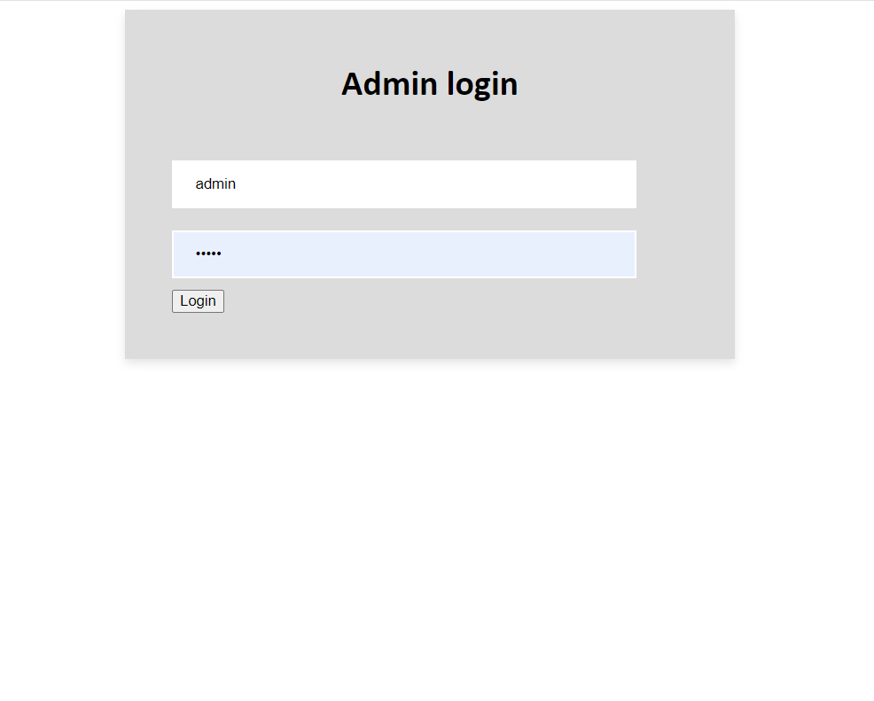

# Administrative Panel

Contributors
--
- Yunshan Li (First Year CS Major)
- Byron Chan (Fourth Year CE Major)
- Daniel Lov (First Year CS Major)

Features
--

- Ability to scale and add computers to desired setup.
- Ability to check in students and place them at a specific spot.
- Ability to check when a specific station had started its session.
- Ability to remove users at will to accomodate for others.

Problem
--
At UC San Diego, the Trition Esports Cafe often experiences a large amount of traffic and a solution is required to remedy this issue. How can we solve this in a scalable and streamline manner?

 [^2]

Solution
--
A web server was developed in order to remedy this issue. A combination of HTML and Javascript was used to create two separate UIs: 
- A panel that would allow the individuals to select a computer to reserve.
- An admin panel that would allow the user to make changes to the lay out of the grids used within the Triton Esports Center

Video Demonstration
--

[

Language Stack
--
- Python [^1]
- HTML
- Javascript
- CSS

Footnotes
--
[^1]: Flask Framework was used along with standard Python.
[^2]: Image of Triton Esports Center provided by Google.    
